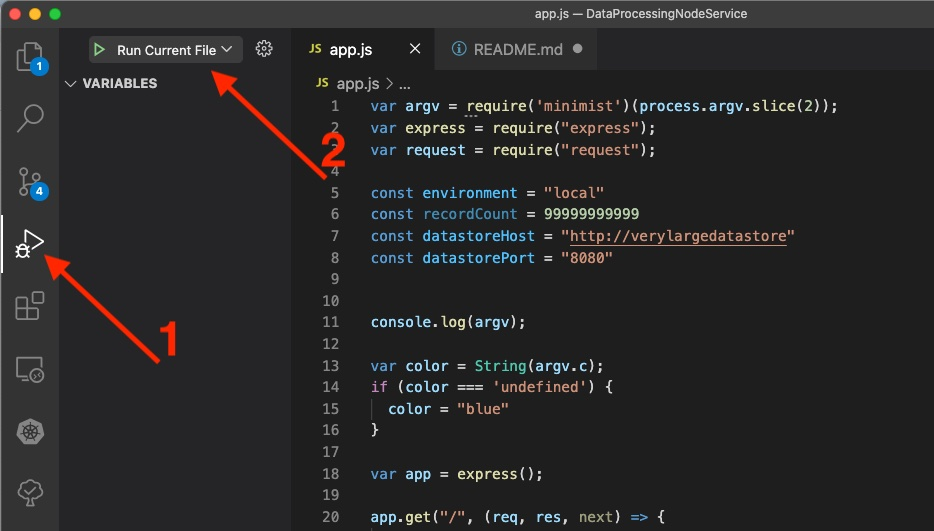

# edgey-corp-nodejs
The Ambassador Telepresence Quickstart App assumes that you have already installed Ambassador Telepresence locally, and also that you have access to an empty Kubernetes cluster and kubectl access to this cluster.

First, install the AES Kubernetes Ingress. If you want more configuration options for installing an Ingress (including cloud-specific load balancer config) please visit the [K8s Initializer](https://app.getambassador.io/initializer/)

```
cd k8s-config

kubectl apply -f 1-aes-crds.yml && kubectl wait --for condition=established --timeout=90s crd -lproduct=aes

kubectl apply -f 2-aes.yml && kubectl wait -n ambassador deploy -lproduct=aes --for condition=available --timeout=90s
```

Wait a few moments for an IP address to be assigned to the external load balancer. If you are using the AES, you can run this command:

```
AMBASSADOR_SERVICE_IP=$(kubectl get service -n ambassador ambassador -o jsonpath='{.status.loadBalancer.ingress[0].ip}')
echo $AMBASSADOR_SERVICE_IP
```

Now install the EdgeyCorp Web App into your cluster:

```
kubectl apply -f edgey-corp-web-app.yaml 
```

You can verify the Services and Pods have been installed correctly using the following commands:

```
kubectl get svc
NAME                        TYPE        CLUSTER-IP     EXTERNAL-IP   PORT(S)    AGE
dataprocessingnodeservice   ClusterIP   10.3.249.16    <none>        3000/TCP   9s
kubernetes                  ClusterIP   10.3.240.1     <none>        443/TCP    10m
verylargedatastore          ClusterIP   10.3.255.106   <none>        8080/TCP   7s
verylargejavaservice        ClusterIP   10.3.249.55    <none>        8080/TCP   8s

kubectl get pods
NAME                                         READY   STATUS    RESTARTS   AGE
dataprocessingnodeservice-5f6bfdcf7b-wgcpj   1/1     Running   0          37s
verylargedatastore-855c8b8789-wz4x8          1/1     Running   0          36s
verylargejavaservice-7dfddbc95c-j2twh        1/1     Running   0          36s

```

Next, access AMBASSADOR_SERVICE_IP in your browser, and note the title color and the architecture of the application you have just deployed that is shown in the image.


## Setup your local Node development environment
Now you set up a local Node development environment with the DataProcessingNodeService running locally and use Ambassador Telepresence to intercept traffic in your remote cluster and route it to your local service.

If you don't already have Node installed on your local machine, instructions can be found on the [Node website Downloads page](https://nodejs.org/en/download/).


```
cd ../DataProcessingNodeService

npm install
npm start

# This application will run on port 3000 by default with the color variable set in the code as blue that the VeryLargeJavaService calls via the `/color` API endpoint.


```

## Configuring Telepresence 
Now you can create an intercept on the dataprocessingnodeservice Service and route remote traffic to port 3000 on your local machine.

First, set up the intercept:

```
telepresence intercept dataprocessingnodeservice --port 3000
```

Refresh your browser page for $AMBASSADOR_SERVICE_IP to see the color and environment change based on the differences in the node service running on your local machine.

You can easily see the intercepts that are available and running using the `list` command:

```
telepresence list
verylargejavaservice     : ready to intercept (traffic-agent not yet installed)
verylargedatastore       : ready to intercept (traffic-agent not yet installed)
dataprocessingnodeservice: intercepted
    State       : ACTIVE
    Destination : 127.0.0.1:3000
    Intercepting: all connections
```

## Fast Debugging with Telepresence

Next, stop the node process running in the terminal and open the app.js file in your favourite IDE. Here we'll use Visual Studio code

```
(ctrl-c on node process)
Open Visual Studio Code
```
Run the app.js file by clicking on the "Run" side navigation option, selecting "Run Current File" from the run/debug dropdown box that appears, and clicking the "Run" triangular icon.



With the app now running you can refresh your browser pointing at $AMBASSADOR_SERVICE_IP/ and see the Debug Console logging that your local service running in debug mode has been accessed. The web page should render normally with the default local color of blue.

You can now set breakpoints and watches on the app.js code, just as you would normally do when debugging. Every time you hit refresh in your browser the VeryLargeJavaService will connect via Telepresence to your locally running service.

Remember to set a high timeout on your Ingress (e.g. 60 seconds) if you want to explore code and variable content when your breakpoint is hit without the user request made via the Ingress from timing out.

When you have finished debugging you can stop the intercept by using the `leave` command. Do this now:

```
telepresence leave dataprocessingnodeservice
```

## Previewing Changes with a Friend or Colleague

You will need to login before generating a preview link with Ambassador Telepresence. Let's try this now, and set up a new intercept with the dataprocessingnodeservice:

```
telepresence login

Launching browser authentication flow...
Login successful.
```
```
telepresence intercept dataprocessingnodeservice --port 3000
```

You will now be prompted to specify your internal Ingress hostname (service.namespace), port number, and TLS options for the intercept. If you installed the default AES installation, be sure to select "80" for the external port and "n" to TLS:

```
Confirm the ingress to use for preview URL access
Ingress service.namespace [ambassador.ambassador] ? 
Port [80] ? 80
Use TLS y/n [n] ? n
```

Your preview link will be shown below the command, and can also be found in the Ambassador Cloud web UI.

```
Using deployment dataprocessingnodeservice
intercepted
    State       : ACTIVE
    Destination : 127.0.0.1:3000
    Intercepting: HTTP requests that match all of:
      header("x-telepresence-intercept-id") ~= regexp("e105abbe-7500-46a0-a0a6-003fd2f48414:dataprocessingnodeservice")
    Preview URL : https://recursing-benz-1011.preview-beta.edgestack.me
``` 

Run the app.js file locally via your IDE. If you are using VSCode you can do this by clicking on the "Run" side navigation option, selecting "Run Current File" from the run/debug dropdown box that appears, and clicking the "Run" triangular icon.

Note that if you view the app via the preview URL you will see the intercepted version of the dataprocessingnodeservice that is running locally on your machine and displays the color blue. 

If you view the app via the AMBASSADOR_SERVICE_IP or regular URL you will see the default non-intercepted version of the dataprocessingnodeservice, and the color will be green. The preview URL injects a header into the request that allows you to create a selective intercept. Only people you share the preview URL with will be able to see the results of changes to your local intercepted service.

Share the preview link with a friend or colleague via a Slack, Teams, or email message.

```
Hi, join me for collaborative bug hunting session with Ambassador Telepresence. Access via the preview link and see me making code changes live while only running one service locally!

Preview URL: https://recursing-benz-1011.preview-beta.edgestack.me
```

Once they have authenticated via Ambassador they will be able to see the results of your dataprocessingnodeservice interception i.e. they can see the results of any local changes you make. The authentication step ensures that only people from the same organization can access your preview links.

Get your friend to tell you when they can see the EdgyCorp WebApp home page. Tell them to look at the application architecture diagram and note that you are running the DataProcessingNodeService locally and all the other services are running in a remote cluster.

Now get your friend to click on the link at the bottom of the page "Join a friend for some collaborative bug hunting!"

On the "EdgyCorp: Merchandise Search" page that display in their browser, have your friend select options in the radio boxes and click "Submit". Search results should be displayed in the table below the search.


As your friend is searching note that you can see the logging statements in your console or debug output.

One combination of "country" and "season" results in no records being displayed. This is a bug. 

Once your friend has found the search combination that demonstrates bug, set a breakpoint in your `app.js` code in the `findMerch` API endpoint and look at the verylargedatastore search query being generated.

As you are connected to the Kubernetes cluster network via Ambassador Telepresence, you can also curl the remote verylargedatastore as if you were in the cluster. There is an endpoint that allows you to see all of the seasons available in the data store:

```
curl http://verylargedatastore:8080/seasons
```

Based on the search query string you can see when debugging `app.js` and the results from the seasons query, can you see what the bug may be?

You can experiment by curling the verylargedatastore with an updated query and seeing if results are returned correctly.

Once you have found the bug, see if you can modify the code in the `findMerch` API endpoint to address this issue. 

When you have made the change, restart app.js via your IDE and have your friend make the same search via their preview link web page. Does the fix work?

If so, this would be the point that you would commit your changes in `app.js` to your version control system, ready for testing and deployment via a continuous delivery pipeline.

If you have any questions or feedback, please join the Ambassador community in the #telepresence channel within the [Ambassador Slack](d6e.co/slack).
