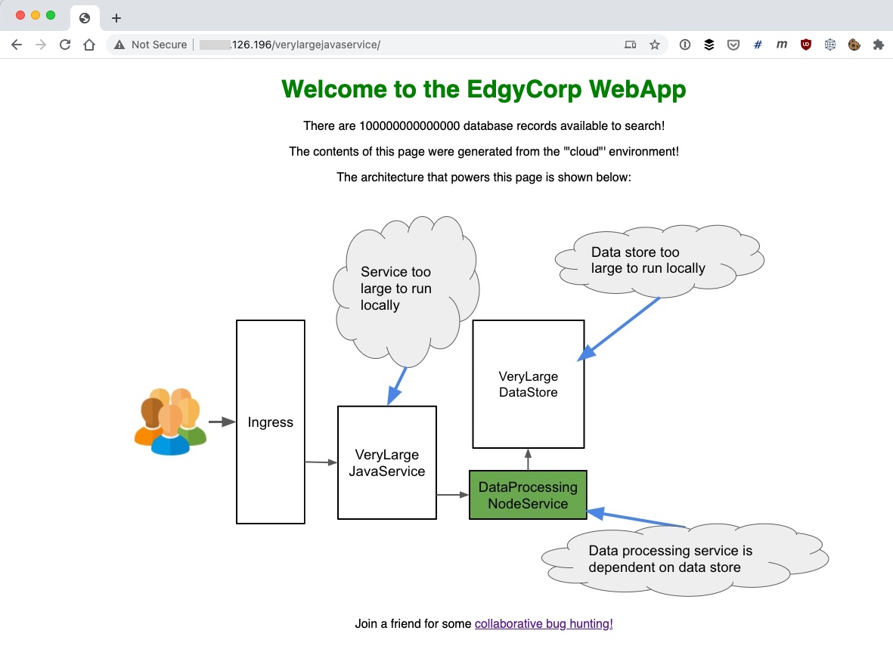

# amb-code-quickstart-app
The Ambassador Code Quickstart App assumes you have access to an empty Kubernetes cluster and kubectl access to this cluster.

First, install the AES Kubernetes Ingress. If you want more configuration options for installing an Ingress (including cloud-specific load balancer config) please visit the [K8s Initializer](https://app.getambassador.io/initializer/)

```
cd k8s-config

kubectl apply -f 1-aes-crds.yml && kubectl wait --for condition=established --timeout=90s crd -lproduct=aes

kubectl apply -f 2-aes.yml && kubectl wait -n ambassador deploy -lproduct=aes --for condition=available --timeout=90s
```

Wait a few moments for an IP address to be assigned to the external load balancer. If you are using the AES, you can run this command:

```
AMBASSADOR_SERVICE_IP=$(kubectl get service -n ambassador ambassador -o jsonpath='{.status.loadBalancer.ingress[0].ip}')
echo $AMBASSADOR_SERVICE_IP
```

Now install the EdgyCorp Web App into your cluster:

```
kubectl apply -f edgy-corp-web-app.yaml 
```

You can verify the Services and Pods have been installed correctly using the following commands:

```
kubectl get svc
NAME                        TYPE        CLUSTER-IP     EXTERNAL-IP   PORT(S)    AGE
dataprocessingnodeservice   ClusterIP   10.3.249.16    <none>        3000/TCP   9s
kubernetes                  ClusterIP   10.3.240.1     <none>        443/TCP    10m
verylargedatastore          ClusterIP   10.3.255.106   <none>        8080/TCP   7s
verylargejavaservice        ClusterIP   10.3.249.55    <none>        8080/TCP   8s

kubectl get pods
NAME                                         READY   STATUS    RESTARTS   AGE
dataprocessingnodeservice-5f6bfdcf7b-wgcpj   1/1     Running   0          37s
verylargedatastore-855c8b8789-wz4x8          1/1     Running   0          36s
verylargejavaservice-7dfddbc95c-j2twh        1/1     Running   0          36s

```

Next, access AMBASSADOR_SERVICE_IP/verylargejavaservice/ in your browser, and note the title color and the architecture of the application you have just deployed that is shown in the image.




## Setup your local Node development environment
Now you set up a local Node development environment with the DataProcessingNodeService running locally and use Ambassador Telepresence to intercept traffic in your remote cluster and route it to your local service.

If you don't already have Node installed on your local machine, instructions can be found on the [Node website Downloads page](https://nodejs.org/en/download/).


```
cd ../DataProcessingNodeService

npm install

# This application will run on port 3000 by default and the -c param specifies the color variable that the VeryLargeJavaService calls via the `/color` API endpoint.
node app -c blue
```

## Telepresence 
Now you can create an intercept on the dataprocessingnodeservice Service and route remote traffic to port 3000 on your local machine.

```
telepresence intercept dataprocessingnodeservice --port 3000
```

Refresh your browser page for $AMBASSADOR_SERVICE_IP/verylargejavaservice/ to see the color and environment change based on the differences in the node service running on your local machine.

You can easily see the intercepts that are available and running using the `list` command:

```
telepresence list
verylargedatastore       : traffic-agent not installed
dataprocessingnodeservice: intercepted, redirecting port 6002 to 127.0.0.1:3000
verylargejavaservice     : traffic-agent not installed
```

You can stop the intercept by using the `leave` command. Do this now:

```
telepresence leave dataprocessingnodeservice
```

## Previewing 

You will need to login before generating a preview link with Ambassador Telepresence:

```
telepresence login
telepresence intercept dataprocessingnodeservice --port 3000
```

Look in the web UI for your preview link.